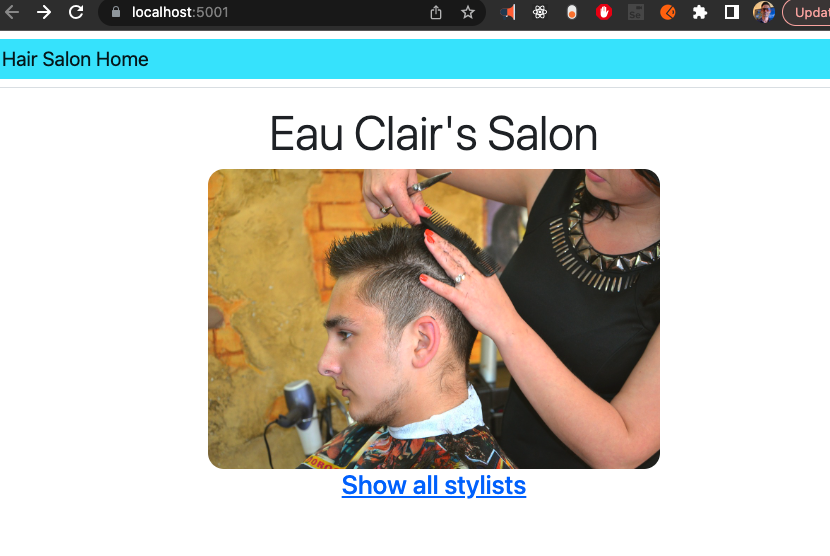

# _{Eau Clair's Hair Salon MVC with ASP.NET Core and Entity Framework Core}_

#### By _**{Dan Kiss}**_


#### _{Eau Clair's Salon MVC is an ASP.NET Core MVC app using Entity Framework Core. It is written in C# and allows the user to connect to to a MySQL database where the user will store added Stylists and once a Stylist is made a Client can be added to each Stylist and stored.}_

## Technologies Used

* Entity Framework Core
* MySQL
* MySQL Workbench
* ASP.NET Core MVC
* .NET Core
* .NET CLI
* C#
* Razor
* CSS

## Description

To run the application navigate to the HairSalon folder in the command line and add a file named appsettings.json that is filled in as below, change [username] and [password] to the username and password you have in MySQL server. MySQL server must be installed on your machine to run this project.

```
{
    "ConnectionStrings": {
    "DefaultConnection": "Server=localhost;Port=3306;database=dan_kiss;uid=[username];pwd=[password];",
    "TestConnection": "Server=localhost;Port=3306;database=dan_kiss;uid=root;pwd=epicodus;"
}
}
```

Once you have set up appsettings.json run 

$ dotnet restore

$ dotnet run

As Entity Framework Core is used with the standard naming convention there is not testing added as there is not unique functions used that should be tested.

## Setup/Installation Requirements

* _navigate to the HairSalon folder and run_
* _$ dotnet restore_
* _run $ dotnet run_
* _Go to localhost:5001_
* _Click Show all Stylists_
* _Click Create a new stylist_
* _Fill out the Stylist's name and details about them_
* _Click Add new stylist_
* _You are taken back to the stylist page_
* _Click on the stylist you made_
* _Click Create a new client_
* _Fill out the Client's name and details about them and pick the stylist you want to assign the client to_
* _Click Add new client_
* _You are taken to the stylist page, Click on the stylist you assigned the client to_
* _You will see the client assigned to the stylist_

_{Double check that the bin and obj folders are created in the HairSalon folder}_

## Known Bugs

* _None_

## Idea to expand on

* _Allow the Stylist to be updated. Allow the Stylist to be deleted and have clients with them assigned to an "Unassigned" stylist for the business owner to allocate. Allow the Client to be updated. Allow the Client to be deleted. Add more customer friendly routing as you move between screens. Make url strings lowercase.

## Notes on project

* _Important to ensure the model is passed to the View when needed using View(model) to avoid NullReferenceException_
* _The naming convention for Entity Framework Core must be followed in the model to be able to capture all data from the form used to create new objects from Views including SelectList dropdowns_
* _The MySQL column types must match the data types used in objects (Use Int for Id not VarChar(45))_
* _In MySQLWorkbench you need to click the apply button to save changed data_
* _.NET CLI was used to make initial project structure $ dotnet new mvc_

## Git Note
Remove bin and obj folders from git with 
$ git rm --cached obj -r 
$ git rm --cached bin -r

## License

_{MIT License}_

Copyright (c) _2023_ _Daniel Kiss_